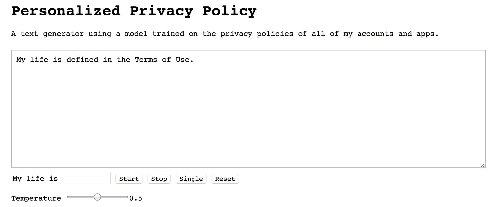

# Generating Text with a LSTM Neural Network

Originally posted on October 16, 2018, for Neural Aesthetic @ NYU ITP Fall 2018



Since my last post for Neural Aesthetic, I’ve gained a broader view of accessible tools to develop machine learning projects, such as [ml4a](https://ml4a.github.io/), [ML5](https://ml5js.org/), and [Wekinator](http://www.wekinator.org/). This survey helped me understand that I’m most interested in developing projects with the potential to generate potentially distinct content (expressive output) with potentially distinct and expressive input.

## GUIDING QUESTIONS

I chose to work with ML5’s LSTMGenerator() which is a type of Recurrent Neural Network “[useful for working with sequential data (like characters in text or the musical notes of a song) where the order of the that sequence matters](https://ml5js.org/docs/LSTMGenerator).” I applied the tool to two bodies of text with the intended purpose of generating new text one character at a time.

My goals for this project included:

- Could I identify and find text that is perhaps often unread or overlooked?
- If so, what voice might emerge if I trained a model based on the data I collected?
- What will I learn from the process of collecting, cleaning, and training a model?

## TOPIC 1: PRIVACY POLICIES

I created a dataset of privacy policies from all the websites where I maintain an account and for every app installed on my connected devices (laptop, mobile phone, and tablet).

### Data Collection & Cleaning

To my knowledge, a clearinghouse of privacy policies does not exist so I tracked down the policies for all of my accounts and apps, 215 in total, and copied and pasted the text into separate RTF files. Of note, I did not collect privacy policies of every website I visited during the data collection process nor the privacy policies of third-party domains that supply content for or track my information (device information, browsing history/habits, etc) on websites that I visited. This monotonous process took me about a week, mostly during study breaks.

In order to train a machine learning model on this data, it needs to be in one file and “cleaned” as much as possible. I spent some time investigating different approaches and finally found one that worked well (and did not crash my apps in the process):

1. Using the command line tool, textutil, I concatenated all the RTF files into one giant HTML file
2. I copied the text from HTML file into a RTF file in TextEdit on my Mac
3. With all text selected, I removed all the bullet formatting
4. Next, I converted the text to plain text (Format > Make Plain Text)
5. Finally, and through several rounds, I removed most of the empty lines of space throughout the document

The final file totaled 4.9MB at about 1,600 pages if printed. This was good news as both [Gene](http://genekogan.com/) and [Cris](https://cvalenzuelab.com/) encouraged me to collect as much text as possible, at least 1MB.

### Training the Model

Cris tipped me off to a service from Paperspace, Gradient, which offers a command line interface for training machine learning models and this [very useful tutorial](https://blog.paperspace.com/training-an-lstm-and-using-the-model-in-ml5-js/) that he authored. Thanks, Cris! This process trains a model using TensorFlow on a GPU hosted by Paperspace. (If I initiated on the training on my 2015 MacBook Pro it would likely takes weeks.)

Of note, the ML5 tutorial on [training a LSTM](https://ml5js.org/docs/training-lstm) suggests different hyperparameters to use for varying sizes of datasets. For my 4.9MB file, I went with these in my run.sh file:

```python
--rnn_size 512 \
--num_layers 2 \
--seq_length 128 \
--batch_size 64 \
--num_epochs 50 \
```

My first training on the [NVIDIA Quadro P5000](https://www.pny.com/nvidia-quadro-p5000), took around one hour to complete (and about $0.78/hr). A week later, having added several more privacy policies from recently created accounts and finally honed my data-cleaning process (mentioned above), I used the [NVIDIA Quadro M4000](https://www.pny.com/nvidia-quadro-m4000) (the P5000 was full) and the process took about two hours (at $0.51/hr). (I’m super curious to come back to this post in several years and compare computing power and rates.) When the training finished, it was quick to download the model from Paperspace into my local computer’s project directory.

### Using the Model with ML5

ROUND 1 - ML5’s [Interactive Text Generation LSTM example](https://ml5js.org/docs/lstm-interactive-example) using P5.js was included when I cloned the repo for training a LSTM with Paperspace. With a local server running and with the model loaded, initiated text prediction by seeding the program with a few words. I chose how many characters it would predict and the “temperature” or randomness of the prediction on a scale of 0 to 1 (1 being closer to the original text and 0 offering more deviations).

This was fun to play with but extremely slooow to respond when entering seed text…painfully so…freezing my browser slow, especially as I increased the length of the prediction. Speaking with Cris in office hours, I learned that this is example is stateless, in other words every time a new seed character is entered, it and all of the previous characters are used to recalculate an entirely new prediction. Screen grab below, prediction in blue.


ROUND 2 - Just my luck, about an hour before talking to Cris, machine learning artist, [Memo Akten](http://www.memo.tv/), made a ML5 pull request with a stateful LSTM example: “Instead of feeding every single character every frame to predict the next character, we feed only the last character, and instruct the LSTM to remember its internal state.” Excited to see how it would work, we downloaded the entire ML5 library, integrated Memo’s example, and ran it on my computer. Much faster and even more fun!


## TOPIC 2: THE CONGRESSIONAL RECORD OF THE UNITED STATES CONGRESS

For a variety of reasons, I’ve been thinking a lot about trust these days (ahem, see above). Perhaps that’s how I eventually found myself at the Library of Congress website reading the daily report of events and floor debates from the 115th Congress.

### Data Collection & Cleaning

I found all of the documents [here](https://www.congress.gov/congressional-record/browse-by-date#) in digital form dating back to 1989. My initial impulse was to collect all records from January 20, 2017, to the current day, and it was quick to download all 389 PDF documents with a browser extension.

It took a couple of different approaches, but in the end I used a built-in automation function in Adobe Acrobat Pro to convert all the docs into plain text files. Turns out that different tools convert files differently, and Adobe gave me the cleanest results and files of the smallest size. When I combined all docs into one, it totaled over 16,000 pages at nearly 400MB. To my surprise, TextEdit handled my removal of empty spaces and characters converted from graphics very well. (Next time, do this in Python.)

### Training the Model

This time I used a different service, [Spell.run](https://spell.run/), to train my model in no small part because you get \$100 when you sign up right now. Not only did I find an [intro video](https://www.youtube.com/watch?v=ggBOAPtFjYU) on The Coding Train (the best!) but just a week earlier, [Nabil Hassein](https://www.youtube.com/watch?v=0IeqAd2H57g) recorded a tutorial on training a LSTM using Spell. Following along I created a new project folder, activated a virtualenv Python environment and downloaded the [ml5 repo for LSTM training](https://github.com/ml5js/training-lstm.git).

Again it took a couple of rounds, but in the end I trained only one month of data. Even using one of the lower mid-range machine options, K80x8, training nearly 400MB of data would have taken around four days\*. Training three months-worth (46MB) about 12 hours. One month of data (16MB) finished in just under four hours (at \$7/hr) with my hyperparameters set to:

```python
--rnn_size 1024 \
--num_layers 2 \
--seq_length 128 \
--batch_size 128 \
--num_epochs 50 \
```

A new problem that I encountered was: “UnicodeDecodeError: 'utf-8' codec can't decode byte 0xd5 in position 1332: invalid continuation byte.”

By running this command, file --mime input.txt, I learned that in fact in my input file was encoded as ISO-8859-1 and not UTF-8.

I performed a conversion with this, iconv -f ISO-8859-1 -t UTF-8 input.txt > input2.txt, but it did weird stuff to the apostrophes and dashes. Once again, not all TXT conversions are the same.

This worked better and ensured the UTF-8 encoding that I needed:

1. I made a copy of the original file
2. Opened it in TextEdit
3. Converted it to RTF, saved, and closed
4. Made a copy of that file (just in case)
5. Opened that on in Text Edit
6. Converted it to Plain Text, saved, and closed

\*In class today, Gene suggested that I lower the number of epochs from 50 to 5, set the rnn_size to 2048, layers to 3, consider pushing seq_length to 512 at the risk of memory issues, and possibly increasing the batch_size. He also mentioned that adjusting hyperparameters is more of an art than a science.

### Using the Model with ML5

I again used the newly suggested Stateful LSTM ML5 example:


## TAKEAWAYS

I gained a lot of practice from this process. Most of my time was spent thinking about, finding, gathering, and cleaning the data (something that [Jabrils](https://www.youtube.com/channel/UCQALLeQPoZdZC4JNUboVEUg) mentioned last spring during his visit to ITP). After that, it’s kinda like baking: you pop it into the “oven” to train for a coupe of hours (or longer) and hope it comes out fitted juuust right. These particular projects are a bit silly but nevertheless fun to play. I wonder about distilling any amount of information in this way—is it irresponsible? Finally, these particular network generated sequences of individual characters, and for the most part, the resulting text makes some sense—as much sense as reading the legal-speak of the original documents. However, I’m excited to learn about opportunities for whole-word generation later this semester.

## TRY IT!

[Personalized Privacy Policy](https://ellennickles.github.io/personalized-privacy-policy/)

## ADDITIONAL RESOURCES
* [The Unreasonable Effectiveness of Recurrent Neural Networks](http://karpathy.github.io/2015/05/21/rnn-effectiveness/)
* [Understanding LSTM Networks](http://colah.github.io/posts/2015-08-Understanding-LSTMs/)
* [ml4a guide: Recurrent Neural Networks: Character RNNs with Keras](https://github.com/ml4a/ml4a-guides/blob/master/notebooks/recurrent_neural_networks.ipynb)
* [Training a char-rnn to Talk Like Me](https://hjweide.github.io/char-rnn)
